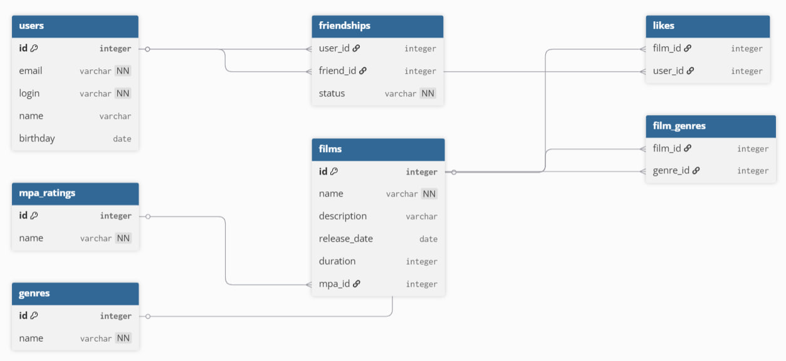

# Filmorate

Бэкенд сервиса для работы с фильмами и оценками пользователей. Возвращает топ фильмов, рекомендованных к просмотру.

## Технологии

- Java 21
- Spring Boot
- Maven
- Lombok

## Функциональность

- Добавление, обновление и получение фильмов и пользователей
- Лайки фильмов
- Система друзей с подтверждением дружбы
- Топ популярных фильмов по количеству лайков
- Список общих друзей

## Схема базы данных



### Описание таблиц

- films — фильмы с основными характеристиками
- users — пользователи сервиса
- mpa_ratings — справочник рейтингов MPA (G, PG, PG-13, R, NC-17)
- genres — справочник жанров (Комедия, Драма, Мультфильм, Триллер, Документальный, Боевик)
- film_genres — связь фильмов и жанров (многие ко многим)
- likes — лайки пользователей к фильмам
- friendships — связи дружбы между пользователями со статусом (UNCONFIRMED / CONFIRMED)

### Примеры запросов

**Получить все фильмы с рейтингом MPA:**
```sql
SELECT f.*, m.name AS mpa_name
FROM films f
JOIN mpa_ratings m ON f.mpa_id = m.id;
```

**Получить фильм по id с жанрами:**
```sql
SELECT f.*, m.name AS mpa_name, g.name AS genre_name
FROM films f
JOIN mpa_ratings m ON f.mpa_id = m.id
LEFT JOIN film_genres fg ON f.id = fg.film_id
LEFT JOIN genres g ON fg.genre_id = g.id
WHERE f.id = 1;
```

**Топ-10 популярных фильмов по лайкам:**
```sql
SELECT f.*, COUNT(l.user_id) AS likes_count
FROM films f
LEFT JOIN likes l ON f.id = l.film_id
GROUP BY f.id
ORDER BY likes_count DESC
LIMIT 10;
```

**Получить всех пользователей:**
```sql
SELECT * FROM users;
```

**Получить пользователя по id:**
```sql
SELECT * FROM users WHERE id = 1;
```

**Получить всех друзей пользователя:**
```sql
SELECT u.*
FROM users u
JOIN friendships f ON u.id = f.friend_id
WHERE f.user_id = 1
AND f.status = 'CONFIRMED';
```

**Список общих друзей двух пользователей:**
```sql
SELECT u.*
FROM users u
JOIN friendships f1 ON u.id = f1.friend_id AND f1.user_id = 1
JOIN friendships f2 ON u.id = f2.friend_id AND f2.user_id = 2
WHERE f1.status = 'CONFIRMED'
AND f2.status = 'CONFIRMED';
```

## Запуск

mvn spring-boot:run
Приложение запустится на http://localhost:8080

## API

### Фильмы

| Метод | Эндпоинт | Описание |
|-------|----------|----------|
| GET | /films | Получить все фильмы |
| GET | /films/{id} | Получить фильм по id |
| POST | /films | Добавить фильм |
| PUT | /films | Обновить фильм |
| PUT | /films/{id}/like/{userId} | Поставить лайк |
| DELETE | /films/{id}/like/{userId} | Удалить лайк |
| GET | /films/popular?count={count} | Топ фильмов по лайкам |

### Пользователи

| Метод | Эндпоинт | Описание |
|-------|----------|----------|
| GET | /users | Получить всех пользователей |
| GET | /users/{id} | Получить пользователя по id |
| POST | /users | Создать пользователя |
| PUT | /users | Обновить пользователя |
| PUT | /users/{id}/friends/{friendId} | Добавить в друзья |
| DELETE | /users/{id}/friends/{friendId} | Удалить из друзей |
| GET | /users/{id}/friends | Список друзей |
| GET | /users/{id}/friends/common/{otherId} | Общие друзья |
