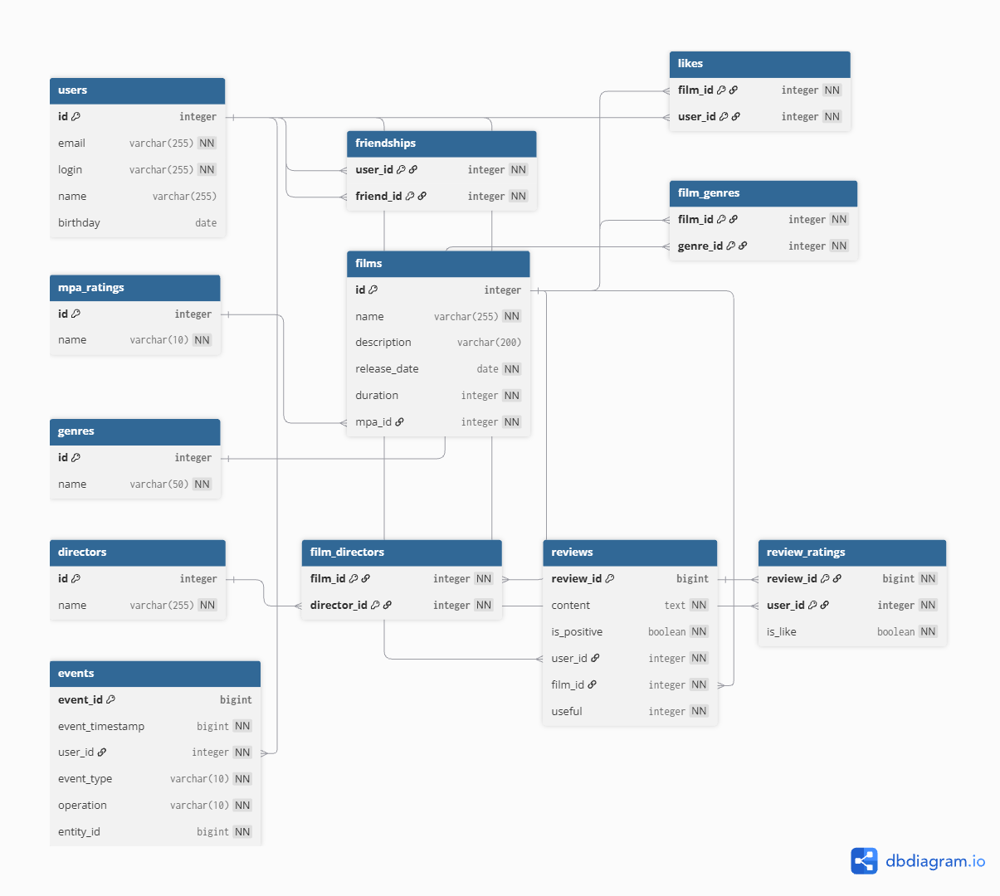

# Filmorate

Бэкенд сервиса для работы с фильмами, пользователями, отзывами и рекомендациями.

## Технологии

- Java 21
- Spring Boot
- Spring JDBC
- H2
- Maven
- Lombok

## Функциональность

- Добавление, обновление, получение и удаление фильмов и пользователей
- Односторонние связи дружбы и список общих друзей
- Лайки фильмов и выборка общих фильмов
- Популярные фильмы с фильтрацией по жанру и году
- Режиссёры и сортировка их фильмов по году или популярности
- Поиск фильмов по названию и режиссёру
- Рекомендации на основе пересечения пользовательских лайков
- Отзывы, лайки и дизлайки отзывов
- Лента событий пользователя

## Схема базы данных



### Описание таблиц

- films — фильмы с основными характеристиками
- users — пользователи сервиса
- mpa_ratings — справочник рейтингов MPA (G, PG, PG-13, R, NC-17)
- genres — справочник жанров (Комедия, Драма, Мультфильм, Триллер, Документальный, Боевик)
- film_genres — связь фильмов и жанров (многие ко многим)
- likes — лайки пользователей к фильмам
- friendships — односторонние связи дружбы между пользователями
- directors — режиссёры
- film_directors — связь фильмов и режиссёров (многие ко многим)
- reviews — отзывы на фильмы
- review_ratings — лайки и дизлайки отзывов
- events — события пользователей

### Примеры запросов

**Получить все фильмы с рейтингом MPA:**
```sql
SELECT f.*, m.name AS mpa_name
FROM films f
JOIN mpa_ratings m ON f.mpa_id = m.id;
```

**Получить фильм по id с жанрами:**
```sql
SELECT f.*, m.name AS mpa_name, g.name AS genre_name
FROM films f
JOIN mpa_ratings m ON f.mpa_id = m.id
LEFT JOIN film_genres fg ON f.id = fg.film_id
LEFT JOIN genres g ON fg.genre_id = g.id
WHERE f.id = 1;
```

**Топ-10 популярных фильмов по лайкам:**
```sql
SELECT f.*, COUNT(l.user_id) AS likes_count
FROM films f
LEFT JOIN likes l ON f.id = l.film_id
GROUP BY f.id
ORDER BY likes_count DESC
LIMIT 10;
```

**Получить всех пользователей:**
```sql
SELECT * FROM users;
```

**Получить пользователя по id:**
```sql
SELECT * FROM users WHERE id = 1;
```

**Получить всех друзей пользователя:**
```sql
SELECT u.*
FROM users u
JOIN friendships f ON u.id = f.friend_id
WHERE f.user_id = 1
ORDER BY u.id;
```

**Список общих друзей двух пользователей:**
```sql
SELECT u.*
FROM users u
JOIN friendships f1 ON u.id = f1.friend_id AND f1.user_id = 1
JOIN friendships f2 ON u.id = f2.friend_id AND f2.user_id = 2
ORDER BY u.id;
```

## Запуск

```bash
mvn spring-boot:run
```

Приложение запустится на `http://localhost:8080`.

## API

### Фильмы

| Метод | Эндпоинт | Описание |
|-------|----------|----------|
| GET | /films | Получить все фильмы |
| GET | /films/{id} | Получить фильм по id |
| POST | /films | Добавить фильм |
| PUT | /films | Обновить фильм |
| DELETE | /films/{id} | Удалить фильм |
| PUT | /films/{id}/like/{userId} | Поставить лайк |
| DELETE | /films/{id}/like/{userId} | Удалить лайк |
| GET | /films/popular | Популярные фильмы с фильтрацией по жанру и году |
| GET | /films/common | Общие с другим пользователем фильмы |
| GET | /films/director/{directorId} | Фильмы режиссёра с выбранной сортировкой |
| GET | /films/search | Поиск по названию и режиссёру |

### Пользователи

| Метод | Эндпоинт | Описание |
|-------|----------|----------|
| GET | /users | Получить всех пользователей |
| GET | /users/{id} | Получить пользователя по id |
| POST | /users | Создать пользователя |
| PUT | /users | Обновить пользователя |
| DELETE | /users/{id} | Удалить пользователя |
| PUT | /users/{id}/friends/{friendId} | Добавить в друзья |
| DELETE | /users/{id}/friends/{friendId} | Удалить из друзей |
| GET | /users/{id}/friends | Список друзей |
| GET | /users/{id}/friends/common/{otherId} | Общие друзья |
| GET | /users/{id}/recommendations | Рекомендации фильмов |
| GET | /users/{id}/feed | Лента событий |

### Режиссёры

| Метод | Эндпоинт | Описание |
|-------|----------|----------|
| GET | /directors | Получить всех режиссёров |
| GET | /directors/{id} | Получить режиссёра по id |
| POST | /directors | Добавить режиссёра |
| PUT | /directors | Обновить режиссёра |
| DELETE | /directors/{id} | Удалить режиссёра |

### Отзывы

| Метод | Эндпоинт | Описание |
|-------|----------|----------|
| GET | /reviews | Получить отзывы по рейтингу полезности |
| GET | /reviews/{id} | Получить отзыв по id |
| POST | /reviews | Добавить отзыв |
| PUT | /reviews | Обновить отзыв |
| DELETE | /reviews/{id} | Удалить отзыв |
| PUT | /reviews/{id}/like/{userId} | Поставить лайк отзыву |
| PUT | /reviews/{id}/dislike/{userId} | Поставить дизлайк отзыву |
| DELETE | /reviews/{id}/like/{userId} | Удалить лайк отзыва |
| DELETE | /reviews/{id}/dislike/{userId} | Удалить дизлайк отзыва |

### Справочники

| Метод | Эндпоинт | Описание |
|-------|----------|----------|
| GET | /genres | Получить все жанры |
| GET | /genres/{id} | Получить жанр по id |
| GET | /mpa | Получить все рейтинги MPA |
| GET | /mpa/{id} | Получить рейтинг MPA по id |
